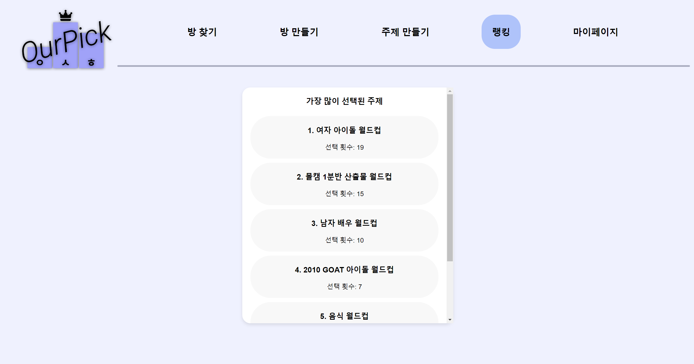

## OurPick

OurPick은 각종 주제에 대한 월드컵을 개최하는 사이트 입니다. 

기존의 사이트들과 다르게 직접 원하는 월드컵을 개최하고, 사람들과 실시간으로 토론하며 월드컵에 참여할 수 있습니다.

## Team

[shyukahn - Overview](https://github.com/shyukahn)

[SPWooSeong - Overview](https://github.com/SPWooSeong)

## Tech Stack

front-end : react + typescript

back-end : django

IDE : VSC

Version Control : Git Hub

## Web Work

### 방 찾기

- 사이트에 접속하게 되면 가장 처음 나오게 되는 화면으로 현재 생성되고, 참여할 수 있는 방들이 나오게 된다.
- 하지만, 로그인 없이는 대부분의 기능을 이용할 수 없다.

### 로그인

- 로그인 화면으로, 구글을 통해 간편하게 로그인 할 수 있다. 기존의 유저는 DB에 있는 정보를 가져오고, 신규 유저는 DB에 등록한다.

### 마이페이지

- 로그인 이후에는 원래 로그인이던 NavBar에서 마이페이지로 변경이 된다.-
- 이 페이지에서는 자신의 프로필을 확인할 수 있으며, 편접 버튼을 통해 플레이 중에 표시될 닉네임을 변경할 수 있다. 기본으로 구글 계정의 이름으로 설정된다.
- 로그아웃 버튼을 통해 로그아웃 할 수 있다.

### 방 만들기

- 로그인 이후, 스스로 원하는 방을 만들 수 있다.
- 방 제목, 주제, 최대 인원을 설정하여 방을 만들게 된다. DB에 주제로써 등록되어 있는 정보들을 불러와 사용하게 된다.

### 방 준비

- 로그인 이후, 방 만들기를 하거나 방 찾기에서 원하는 방에 참여하게 된다면, 방 준비로 가게된다.
- 소켓을 통해 실시간으로 방에 참여한 인원이 늘거나 줄며, 방장은 왕관 아이콘이 생기게 된다.
- 방장만이 GO~! 버튼을 누를 수 있다.

### 월드컵 시작

- 기본적으로 투표 기능을 통해 올라갈 요소를 선정한다. 방에 존재하는 모든 사람이 투표에 참여하면 다음 라운드가 되고, 동점이라면 랜덤 요소가 올라가게 된다.
- 선정된 요소는 화면의 중앙으로 이동하는 애니매이션이 나온다

- 투표 중 서로의 의견을 나눌 수 있는 채팅창이 존재한다.
- queue 구조를 이용해 우승자는 다시 큐에 들어가는 방식으로 월드컵을 구현하였으며, 남은 강 수에 따라 몇 강인지 표시된다.

### 우승자 표시

- queue 요소가 1이 되면, 우승 요소에 왕관이 씌워지며, 나가기 버튼이 활성화 된다.
- 방의 모든 인원이 나간다면, DB에서 해당 Room이 사라지게 된다.

### 랭킹 페이지

- 랭킹 페이지에 들어간다면, 가장 많이 선택된 주제에 대한 랭킹이 선택 횟수와 함께 나온다.
- 주제 중 하나를 선택한다면, 아래와 같이 해당 주제에서 가장 많은 선택을 받은 후보가 나오며 스크롤을 통해 순위를 볼 수 있다.

### 주제 만들기

- 주제 만들기 페이지에서 자신만의 월드컵을 만들 수 있다. 제목과 요소의 개수를 select를 통해 골라주면, 해당 개수 만큼의 이미지 입력란이 나온다.
- 전부 입력 후 주제 만들기 버튼을 누르면 주제가 등록되고, 방 만들기, 랭킹 페이지에서 이를 확인 및 사용할 수 있다.

## DataBase

